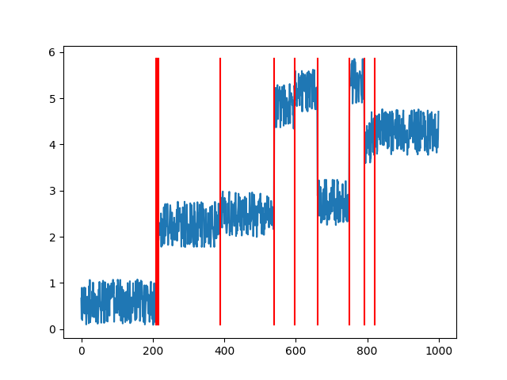
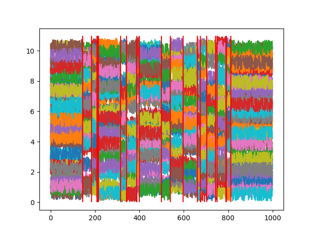
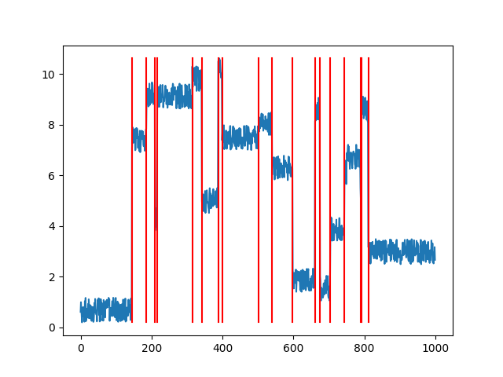

# KTS (Kernel Temporal Segmentation)

This repository contains codes for kernel temporal segmentaion (KTS).
The codes are slight modification of those provided in [MED Summaries](http://lear.inrialpes.fr/people/potapov/med_summaries) and I rewrite weave codes in original ones with Cython for Python3 support.


## Build

```bash
python setup.py build_ext --inplace
```


## Demo

```bash
python demo.py
```

output:

```
Test 1: 1-dimensional signal
Ground truth: [   0  210  211  216  388  540  598  661  750  792  811 1000]
Precomputing scatters...
Inferring best change points...
Estimated: [210 211 216 389 540 596 661 750 792 821]
```




```
Test 2: multidimensional signal
Ground truth: [   0  145  186  210  211  216  315  342  388  399  500  540  598  661
  675  704  744  750  789  792  811 1000]
Precomputing scatters...
Inferring best change points...
Estimated: [145 186 210 211 216 315 342 388 399 500 540 598 661 675 704 744 750 789
 792 811] 
```




```
Test 3: automatic selection of the number of change-points
Ground truth: (m=20) [   0  145  186  210  211  216  315  342  388  399  500  540  598  661
  675  704  744  750  789  792  811 1000]
Precomputing scatters...
Inferring best change points...
Precomputing scatters...
Inferring best change points...
Estimated: (m=18) [145 186 210 216 315 342 388 399 502 540 598 661 675 704 744 789 792 811]
```


